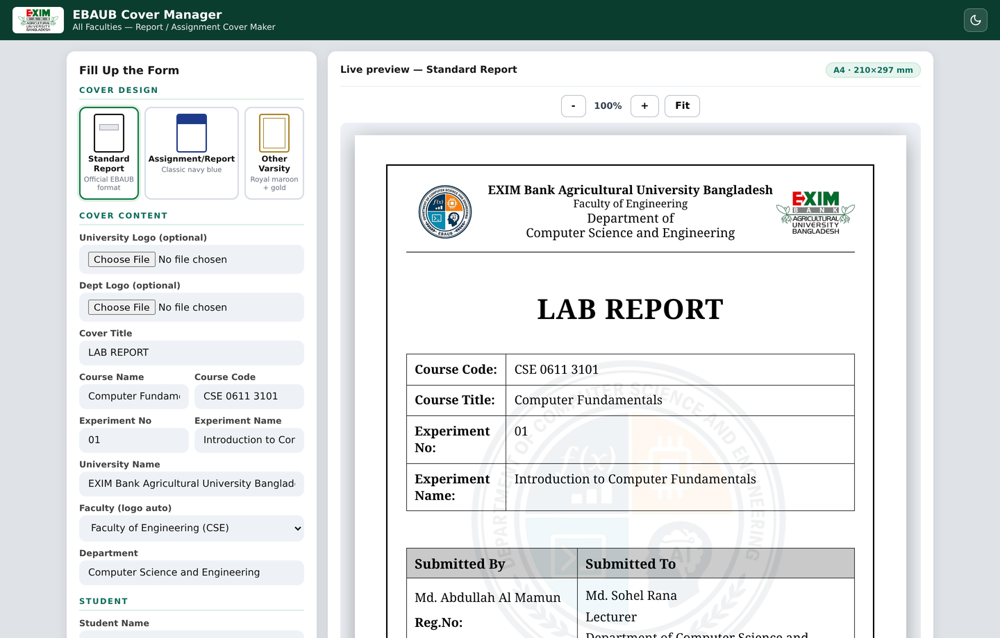
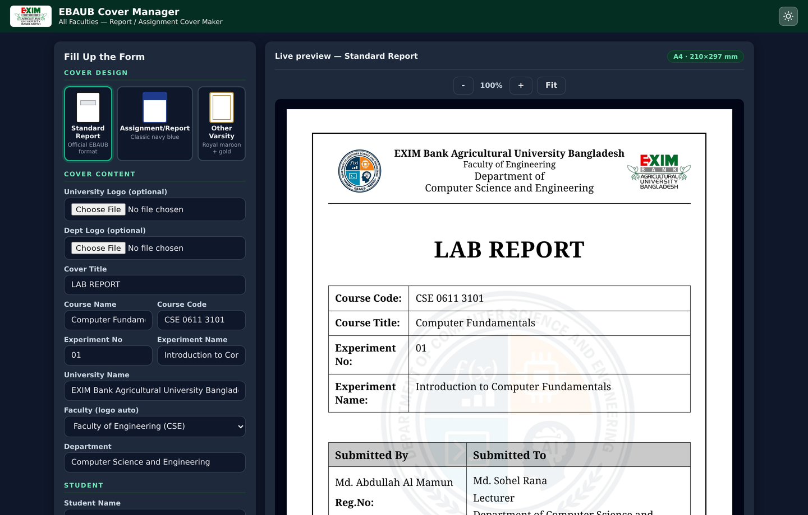
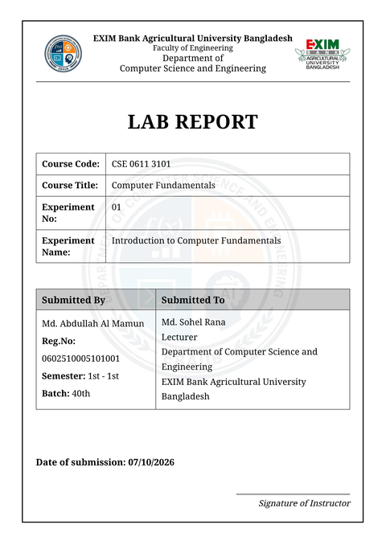
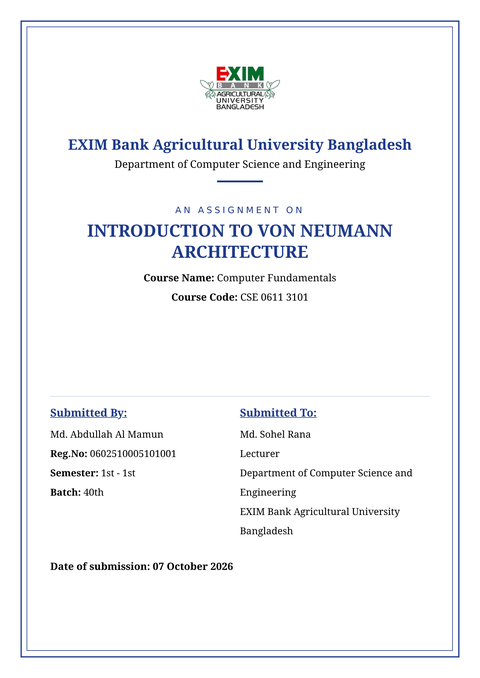
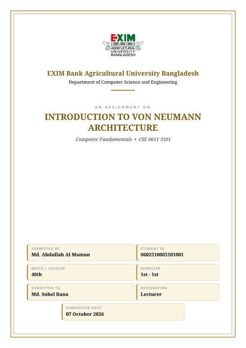
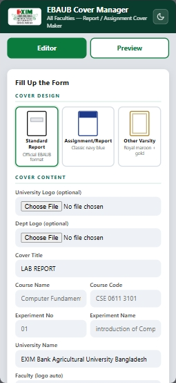
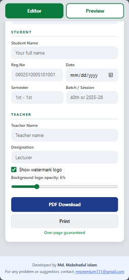
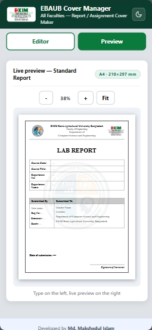

# 🎓 EBAUB Cover Manager

Report / assignment cover page maker for **Exim Bank Agricultural University Bangladesh (EBAUB)** — all faculties.

Fill up the form → live A4 preview → download a 1-page PDF. No login, no database, works offline.

<p align="center">
  <a href="https://maksbloxx.github.io/EBAUB-Cover-Manager/"><strong>Open live demo →</strong></a>
</p>

<p align="center">
  
  
</p>
<p align="center"><sub>Light + dark editor. The A4 cover always stays white for print/PDF.</sub></p>

---

## 🎨 Cover designs

Click a card — the live preview switches instantly.

| Standard Report | Assignment / Report | Other Varsity |
| :---: | :---: | :---: |
|  |  |  |
| Official EBAUB lab-report format | Classic navy blue | Royal maroon + gold |

---

## ✨ Features

- **Live A4 preview** while typing (PC + mobile), auto-scaled to your screen, with zoom (`−` / `+` / Fit)
- **1-page PDF download** (html2canvas @ 3×, JPEG) + Print button
- **3 polished cover designs**, one-click switch with visual picker cards
- **Faculty-wise auto logo** (Engineering, Agriculture, Business, Law, …) or upload your own
- **University logo** + **Dept logo** upload (university first) + watermark with opacity slider
- **Date shows only when picked**; blank-safe fallbacks everywhere
- **Light / dark editor theme** (moon/sun toggle, remembered in `localStorage`) — cover page never goes dark
- **Mobile Editor / Preview tabs** so the A4 still fits on a phone
- **100% client-side** — nothing is uploaded, no server needed

---

## ⚡ How it works

1. **Pick a design** — Standard Report, Assignment/Report, or Other Varsity
2. **Fill the form** — course, student, teacher… the A4 on the right updates live
3. **PDF Download** or **Print** — always one page, 210 × 297 mm

---

## 💻 Run locally

Just open `index.html` in any browser (double-click). No build step.

Or serve the folder:

```bash
cd cover-manager
python3 -m http.server 8000
# open http://localhost:8000
```

---

## 🗂 Project structure

```
cover-manager/
├── index.html          # form + live preview + actions
├── css/style.css       # app UI + all 3 cover designs (PDF-safe)
├── js/app.js           # templates, live preview, PDF export, uploads
├── assets/             # header logo, EXIM seal, faculty logos
├── vendor/             # offline libs (html2canvas, jsPDF) — do not delete
├── previews/           # screenshots used in this README
└── README.md
```

> The `vendor/` folder must stay beside `index.html`, otherwise PDF download won't work offline.

---

## 🚀 Deploy free (GitHub Pages)

1. Upload all files to your repo (`MaksBloxX/EBAUB-Cover-Manager`)
2. Repo → **Settings → Pages** → Deploy from branch → `main` / root
3. Your site goes live at [`https://maksbloxx.github.io/EBAUB-Cover-Manager/`](https://maksbloxx.github.io/EBAUB-Cover-Manager/)

Also works on Netlify Drop, Vercel, Tiiny.host — just drag & drop the folder.

---

## 🛠 Developer note: PDF-safe CSS

The PDF is rendered with `html2canvas` of `#coverPage`, which doesn't support everything.
Inside `.a4` (the A4 page) the CSS intentionally avoids:

- CSS variables (`var(--x)`), CSS grid, flex `gap`
- `object-fit` on fixed-size logo boxes (it gets ignored — match the box to the image aspect instead)
- `display:inline-block` + `% width` combos (use block + `margin:auto`)

Safe: tables, flex rows/columns, literal colors, margins, padding.
The surrounding app UI (`body`, cards, form, dark theme) may use any modern CSS — it is never captured.

---

## 📱 Mobile preview

Editor tab · form · Preview tab — all in one row.

| | | |
| :---: | :---: | :---: |
|  |  |  |

---

## 🙏 Credits

Developed by **Md. Makshedul Islam** — CSE, EBAUB  
Questions or suggestions? [Open an issue](https://github.com/MaksBloxX/EBAUB-Cover-Manager/issues)

Free to use for educational purposes.
